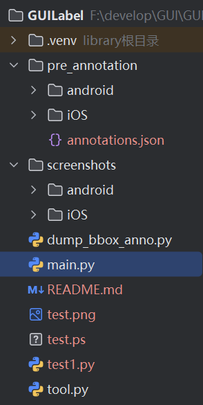
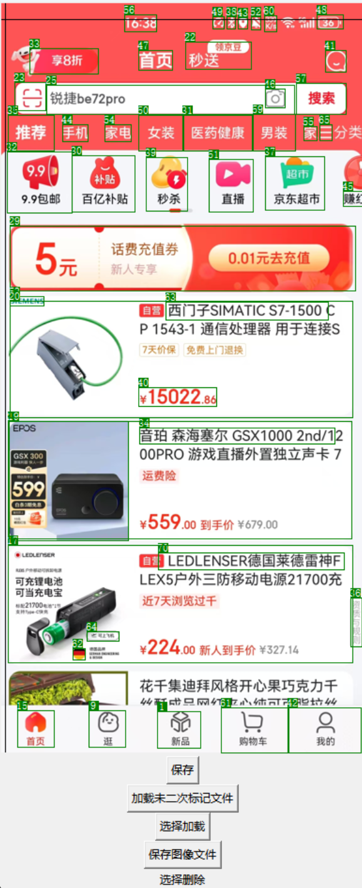

# Install

```bash
pip install pillow
```

# run

```
python ./main.py
```

# directory structure



annotations.json should exist in pre_annotation directory.

path of screenshot_image should be the same in annotations.json.

for example, 

```json
{
  "android": {
    "screenshots\\android\\1-1-1-v10.42.30.jpg": {
        "......": "......"
    }
  }
}
```
in annotations.json, the path of screenshot_image should be ".\screenshots\android\1-1-1-v10.42.30.jpg"

# use



保存：保存目前截图标注的所有内容，并在annotations.json中添加已标记标识。

加载未二次标记文件：加载一张未标记未已标注的截图，显示在当前页面。

选择加载：手动加载一张截图，需要在annotations.json中包含对应的标注信息。

保存图像文件：将当前带有标注框的页面保存到当前文件目录中，默认为test.png

Control 切换添加框模式/删除模式。
* 添加框模式点击两点创建框
* 删除模式点击选择框，delete/backspace键删除
* > 所有操作后只有点击保存才会写入到annotations.json中

# 导出所有带有标注框的图片

运行dump_bbox_anno.py

默认会从 pre_annotation 文件夹中加载annotations.json文件，从screenshots文件夹中加载每个图片，找到annotations.json中对应的标注，绘制标注框并保存到pre_annotations相同路径中。